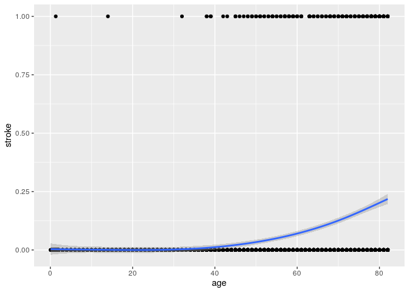
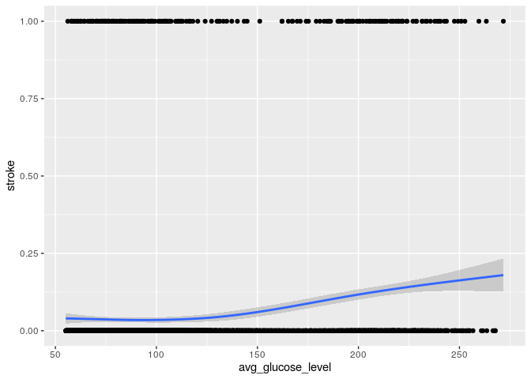

Project proposal
================
Team name

``` r
library(tidyverse)
library(broom)
library(skimr)
```

``` r
stroke <- read_csv("healthcare_dataset_stroke_data.csv")
```

    ## 
    ## ── Column specification ────────────────────────────────────────────────────────
    ## cols(
    ##   id = col_double(),
    ##   gender = col_character(),
    ##   age = col_double(),
    ##   hypertension = col_double(),
    ##   heart_disease = col_double(),
    ##   ever_married = col_character(),
    ##   work_type = col_character(),
    ##   Residence_type = col_character(),
    ##   avg_glucose_level = col_double(),
    ##   bmi = col_character(),
    ##   smoking_status = col_character(),
    ##   stroke = col_double()
    ## )

### Section 1: Introduction

Our group chose to use the “Stroke prediction” dataset
(<https://www.kaggle.com/fedesoriano/stroke-prediction-dataset>) by
Fedesoriano, to answer our research question, which is “Between certain
factors such as gender, age, heart disease, bmi, hypertension which has
the greatest impact on the likelihood of stroke?”

Fedesoriano observed 5110 patients and tried to determine their
potential vulnerability to strokes based on 11 different factors. The
eleven factors were;gender, age, hypertension, heart disease, ever
married , work type, residence type, average glucose level, bmi, smoking
status, and stroke.

### Section 2: Data

See READMEdata file in /data folder. Preliminary exploratory data
analysis is included in the codebook.

``` r
skim(stroke)
```

|                                                  |        |
|:-------------------------------------------------|:-------|
| Name                                             | stroke |
| Number of rows                                   | 5110   |
| Number of columns                                | 12     |
| \_\_\_\_\_\_\_\_\_\_\_\_\_\_\_\_\_\_\_\_\_\_\_   |        |
| Column type frequency:                           |        |
| character                                        | 6      |
| numeric                                          | 6      |
| \_\_\_\_\_\_\_\_\_\_\_\_\_\_\_\_\_\_\_\_\_\_\_\_ |        |
| Group variables                                  | None   |

Data summary

**Variable type: character**

| skim\_variable  | n\_missing | complete\_rate | min | max | empty | n\_unique | whitespace |
|:----------------|-----------:|---------------:|----:|----:|------:|----------:|-----------:|
| gender          |          0 |              1 |   4 |   6 |     0 |         3 |          0 |
| ever\_married   |          0 |              1 |   2 |   3 |     0 |         2 |          0 |
| work\_type      |          0 |              1 |   7 |  13 |     0 |         5 |          0 |
| Residence\_type |          0 |              1 |   5 |   5 |     0 |         2 |          0 |
| bmi             |          0 |              1 |   2 |   4 |     0 |       419 |          0 |
| smoking\_status |          0 |              1 |   6 |  15 |     0 |         4 |          0 |

**Variable type: numeric**

| skim\_variable      | n\_missing | complete\_rate |     mean |       sd |    p0 |      p25 |      p50 |      p75 |     p100 | hist  |
|:--------------------|-----------:|---------------:|---------:|---------:|------:|---------:|---------:|---------:|---------:|:------|
| id                  |          0 |              1 | 36517.83 | 21161.72 | 67.00 | 17741.25 | 36932.00 | 54682.00 | 72940.00 | ▇▇▇▇▇ |
| age                 |          0 |              1 |    43.23 |    22.61 |  0.08 |    25.00 |    45.00 |    61.00 |    82.00 | ▅▆▇▇▆ |
| hypertension        |          0 |              1 |     0.10 |     0.30 |  0.00 |     0.00 |     0.00 |     0.00 |     1.00 | ▇▁▁▁▁ |
| heart\_disease      |          0 |              1 |     0.05 |     0.23 |  0.00 |     0.00 |     0.00 |     0.00 |     1.00 | ▇▁▁▁▁ |
| avg\_glucose\_level |          0 |              1 |   106.15 |    45.28 | 55.12 |    77.24 |    91.88 |   114.09 |   271.74 | ▇▃▁▁▁ |
| stroke              |          0 |              1 |     0.05 |     0.22 |  0.00 |     0.00 |     0.00 |     0.00 |     1.00 | ▇▁▁▁▁ |

### Section 3: Data Analysis Plan

*Explanatory variables:* gender, age, heart disease, bmi, hypertension
*Response variable:* stroke

``` r
summary(stroke)
```

    ##        id           gender               age         hypertension    
    ##  Min.   :   67   Length:5110        Min.   : 0.08   Min.   :0.00000  
    ##  1st Qu.:17741   Class :character   1st Qu.:25.00   1st Qu.:0.00000  
    ##  Median :36932   Mode  :character   Median :45.00   Median :0.00000  
    ##  Mean   :36518                      Mean   :43.23   Mean   :0.09746  
    ##  3rd Qu.:54682                      3rd Qu.:61.00   3rd Qu.:0.00000  
    ##  Max.   :72940                      Max.   :82.00   Max.   :1.00000  
    ##  heart_disease     ever_married        work_type         Residence_type    
    ##  Min.   :0.00000   Length:5110        Length:5110        Length:5110       
    ##  1st Qu.:0.00000   Class :character   Class :character   Class :character  
    ##  Median :0.00000   Mode  :character   Mode  :character   Mode  :character  
    ##  Mean   :0.05401                                                           
    ##  3rd Qu.:0.00000                                                           
    ##  Max.   :1.00000                                                           
    ##  avg_glucose_level     bmi            smoking_status         stroke       
    ##  Min.   : 55.12    Length:5110        Length:5110        Min.   :0.00000  
    ##  1st Qu.: 77.25    Class :character   Class :character   1st Qu.:0.00000  
    ##  Median : 91.89    Mode  :character   Mode  :character   Median :0.00000  
    ##  Mean   :106.15                                          Mean   :0.04873  
    ##  3rd Qu.:114.09                                          3rd Qu.:0.00000  
    ##  Max.   :271.74                                          Max.   :1.00000

``` r
stroke %>%
  ggplot(aes(x=age, y= stroke)) +
  geom_point()+
  geom_smooth()
```

    ## `geom_smooth()` using method = 'gam' and formula 'y ~ s(x, bs = "cs")'

<!-- -->

As individuals grow older the predicted model shows that they are more
likely to be subject to strokes.

``` r
stroke %>%
  ggplot(aes(x= avg_glucose_level, y= stroke)) +
  geom_point()+
  geom_smooth()
```

    ## `geom_smooth()` using method = 'gam' and formula 'y ~ s(x, bs = "cs")'

<!-- --> As the
average glucose level of an individual increases, the model predicts a
higher vulnerability to strokes.

We hope to create some visual representation of the correlation between
stroke and each one of the explanatory variables in order to determine
which one has the greatest effect on death outcome. Specifically, we
plan to create a dot plot or line graph and calculate the correlation
coefficient between each of the variables and stroke outcome. However,
we are currently searching for a better way to represent the data
visually given that the stroke outcome is a boolean value and a dot
plot/line graph may not be the best way to illustrate this.
